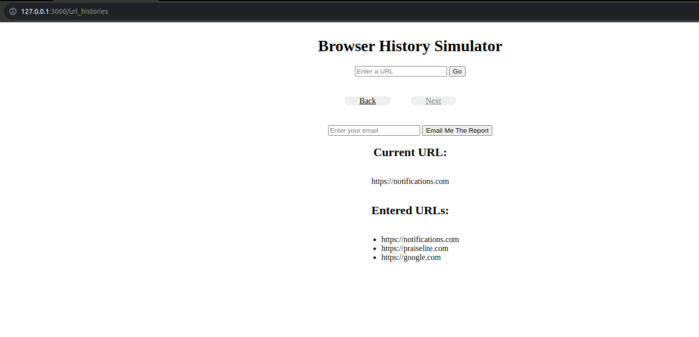

# Twitter Redesign

This project is build for browser history and send get email to your email. It is made based on Ruby on Rails.
      

<div align="center">

[](https://github.com/Dipeshkspar/browser_history_simulator/)
[](https://github.com/Dipeshkspar/browser_history_simulator/issues)
[](https://github.com/Dipeshkspar/browser_history_simulator/pulls)

</div>

## 📝 Contents

<p align="center">
<a href="#with">Built with</a>&nbsp;&nbsp;&nbsp;|&nbsp;&nbsp;&nbsp;
<a href="#sc">Screenshot</a>&nbsp;&nbsp;&nbsp;|&nbsp;&nbsp;&nbsp;
<a href="#gs">Getting started</a>&nbsp;&nbsp;&nbsp;|&nbsp;&nbsp;&nbsp;
<a href="#author">Author</a>
</p>

## 🔧 Built with<a name = "with"></a>

- Ruby on Rails (Version: 6.0.3.2)
- Ruby (Version: 2.7.1)
- Postgresql (version: 12)
- Sidekiq
- Redis

## Screenshot <a name = "sc"></a>

### Index Page



### Email Report Page


### Sidekiq Page


## Getting Started <a name = "gs"></a>

To get a local copy of the repository please run the following commands on your terminal:

```
$ cd <folder>
```

~~~bash
$ git clone https://github.com/Dipeshkspar/browser_history_simulator.git
$ cd browser_history_simulator
$ bundle install
$ yarn install --check-files
~~~

Setup database with:

> make sure you have postgres sql installed and running on your local machine

> Go to config > database.yml

Replace ```youruser_pass``` with your ```own``` postgresql username and password
```
username: youruser_pass
password: youruser_pass
```

> create and migrate the database by these commands

```
   rails db:create
   rails db:migrate
```

### How to run

1. Start server with:

```
    rails s
```

Open `http://localhost:3000/` in your browser.

2. run sidekiq process

```
    sidekiq -c 1
```


## To run Test

~~~ruby
$ rails db:migrate RAILS_ENV=test
$ rspec --format documentation

~~~


## ✒️  Authors <a name = "author"></a>


👤 **Dipesh Kumar**

- Github: [@Dipeshtwis](https://github.com/Dipeshtwis)
- Twitter: [@97deepeshkumar](https://twitter.com/97deepeshkumar)
- Linkedin: [dipeshtwis](https://www.linkedin.com/in/dipeshtwis/)


## 🤝 Contributing

Contributions, issues and feature requests are welcome!

Feel free to check the [issues page](https://github.com/Dipeshkspar/browser_history_simulator/issues).


## 👍 Show your support

Give a ⭐️ if you like this project!

